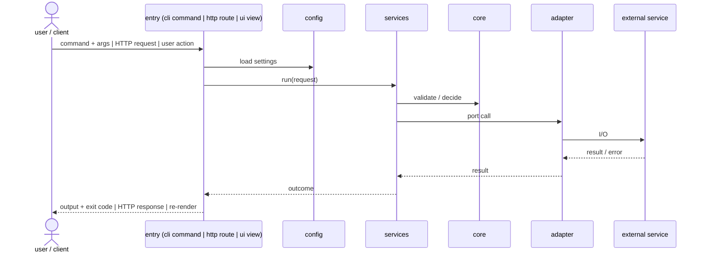
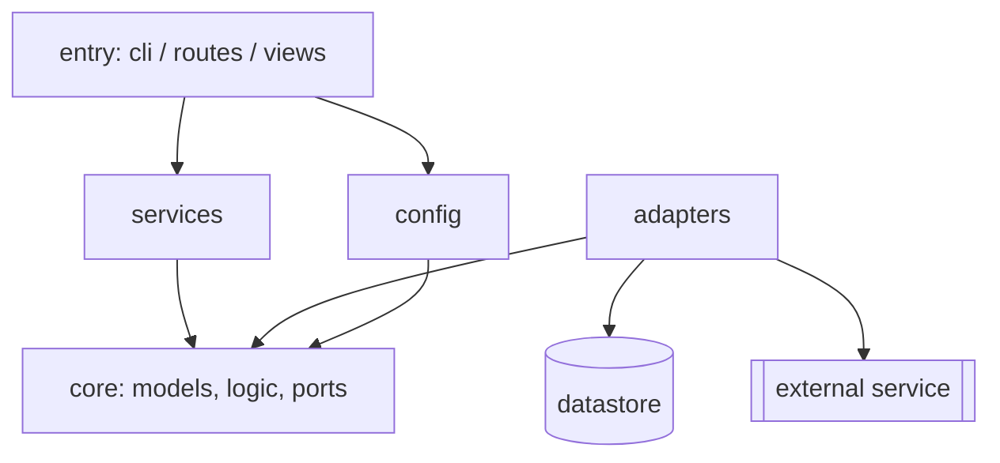

# Architecture Overview: <project name>

- **Status:** current <!-- current | stale (code moved, not yet reconciled) -->
- **Last-reviewed:** <YYYY-MM-DD>

<!--
Explanation only (DOC-010). Written for a new engineer, read top-to-bottom.
Stack note: the placeholders below use a CLI-flavoured layering (entry →
services → core → adapters). For an HTTP/API service the entry is the route
or handler and the outer effect is the response (route → service →
repository); for a UI the entry is the view or component, "services" is the
state/store layer, and the adapter is the API client (view → state → data
layer). Swap the participant names to match the knowledge repo's Structure principles for your stack —
the section shape stays the same.
Prose over tables. Do not restate the module inventory — it lives in
AI.md § Project Catalog; link to it. Rule codes go in the References footer,
not in the body.
-->

## In one paragraph

<BLUF, four things: what the system is; what it takes in and what it produces;
which external systems it talks to (name each one); and the one structural idea
a reader must hold, with the driver behind it in half a sentence (e.g. "a thin
CLI over a dependency-free core; every external effect goes through a Protocol
chosen at startup — so providers can be swapped without touching core", linking
the ADR that made that call). Domain, users,
and non-goals are not restated — link `.docs/spec/intent.md` and
`non-goals.md` in one sentence.>

## One request, outside-in

<Follow a single representative invocation — one CLI command, one API
endpoint, one UI action — from the entry point to the outermost effect and
back. Let each component appear as the walk reaches it: entry/boundary →
orchestration → core → ports → concrete adapters. Name the error path once:
where an expected failure is raised and where it becomes an exit code / HTTP
status / error state on screen. One request is enough: the full endpoint or command list is a
reference matrix and lives in the public-surface / API-contract docs, linked
below, not here.

When the representative request is a pipeline (read → transform → call out →
aggregate → write), the stages are the spine of the walk: name each stage in
order, say which layer owns it, and link the function or module that
implements it. Stay at stage level — what goes in, what comes out, where it
can fail. Per-function behaviour is the code's to explain.>

<Then the same request as a sequence diagram, so a reviewer sees at a glance
how the entry point, config, services, core, and adapters call each other.
Participants are the same boxes as the component diagram below — layers and
components, never classes or functions. One request only; show the error
path once.>

## Start here in the code

<Three to five files, in reading order, each with a half-line on why it is
next — the shortest path from "never seen this repo" to "can follow the walk
above in the source". Typically: the entry point, the one service the walk
goes through, the core model/logic it calls, the port it depends on, one
adapter that implements it. Link each file.>

## Components and dependency direction

<Two or three sentences naming the major components and stating the one
direction dependencies flow. Then the diagram — fenced Mermaid, text source
in this file (DOC-007). This is the static view (who depends on whom); the
sequence above is the runtime view (who calls whom) — same boxes, same names. External systems sit on the edge, drawn as what the
adapters talk to, so the same picture answers "what is out there" and "who
depends on whom".>

<State the one rule a reviewer enforces from this picture: a new import that
goes against an arrow is an architecture change — it needs an ADR, not a nod
in code review. Anything planned but not built is marked
`(not yet implemented)` (DOC-009).>

## Where change lands

<Explanation, not steps: name the seams where the architecture expects
variation — the ports/Protocols, registries, and config switches — and, for
the two or three most common kinds of change (a new external provider, a new
command/endpoint/screen, a new core rule), say which layer each one lands in
and which layers it must not touch. Note that the same seams are the test
seams: tests replace adapters at the port, so a change that cannot be tested
that way is probably in the wrong layer. Link the seams; the how-to lives in
`README.md` / `AI.md`.>

## Cross-cutting concerns

<One short paragraph each on *where* it lives and *which way* it is wired,
linking to the code. Skip any the walk above already covered.
- **Process and state** — how it runs (one process per invocation, a long-
  lived server, workers, a schedule) and where state lives (in memory, files,
  a datastore); the concurrency model if there is one. A maintainer needs this
  before touching anything with a lifecycle.
- **Configuration** — where settings come from and where they are read.
- **Logging / observability** — what is emitted, from which layer.
- **Error taxonomy** — the error types, where each is raised, where it is
  turned into an exit code / status / screen state.>

## Where the details live

- Domain, users, non-goals: `.docs/spec/intent.md`, `non-goals.md`
- Domain model and vocabulary: `.docs/spec/domain.md`, `.docs/spec/glossary.md`
- External contracts and cross-cutting rules as specified: `.docs/spec/external-contracts.md`, `.docs/spec/cross-cutting.md`
- Public surface (commands / endpoints, exit codes / status codes): [`README.md`](../../../README.md), `.docs/spec/public-surface.md`, the API contract if one exists
- Module inventory: [`AI.md` § Project Catalog](../../../AI.md)
- Decisions and their history: [`adr/README.md`](adr/README.md)
- Install / usage / configuration, how to run the tests: [`README.md`](../../../README.md)
- Known structural smells and the latest audits: `.docs/spec/smells.md`, `.docs/active/auditor-*/`
- Per-feature designs: `.docs/active/**/design.md` and `.docs/archive/`

## References

<Rule citations that shaped this document, each with a one-line reason, e.g.
`DOC-003 — names the N components and shows adapters depend inward`.>
